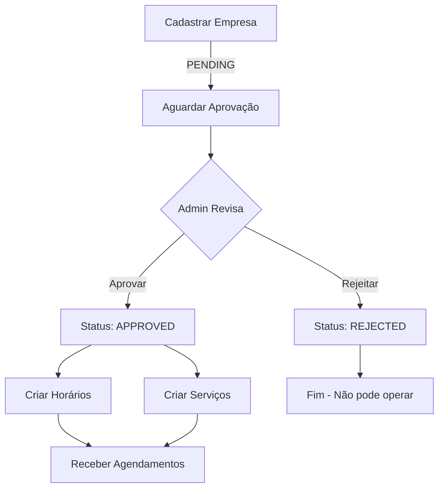

# 🏢 Companies API Documentation

API completa para gerenciamento de empresas, aprovação administrativa e horários de funcionamento.

## Base URL
```
http://localhost:4000/api/companies
```

## Autenticação
Rotas protegidas requerem token JWT no header:
```
Authorization: Bearer {token}
```

---

## 📋 Índice

### Gestão de Empresas
1. [Cadastrar Empresa](#1-cadastrar-empresa)
2. [Buscar Empresas](#2-buscar-empresas)
3. [Buscar Empresa por ID](#3-buscar-empresa-por-id)
4. [Atualizar Empresa](#4-atualizar-empresa)
5. [Remover Empresa](#5-remover-empresa)

### Aprovação Administrativa
6. [Listar Empresas Pendentes](#6-listar-empresas-pendentes)
7. [Atualizar Status da Empresa](#7-atualizar-status-da-empresa)
8. [Estatísticas da Empresa](#8-estatísticas-da-empresa)

### Horários de Funcionamento
9. [Criar Horário](#9-criar-horário)
10. [Listar Horários](#10-listar-horários)
11. [Atualizar Horário](#11-atualizar-horário)
12. [Remover Horário](#12-remover-horário)

---

## 1. Cadastrar Empresa

Cadastra uma nova empresa no sistema (fica pendente de aprovação).

**Endpoint:** `POST /api/companies`

**Acesso:** Público (mas requer aprovação posterior)

### Request Body
```json
{
  "name": "Studio Hair & Beauty",
  "responsible": "Maria Silva",
  "email": "contato@studiohair.com",
  "phoneNumber": "+55 11 98765-4321",
  "address": "Rua das Flores, 123",
  "city": "São Paulo",
  "state": "SP",
  "zipCode": "01234-567",
  "category": "BEAUTY",
  "description": "Salão de beleza especializado em cabelos e maquiagem",
  "latitude": -23.550520,
  "longitude": -46.633308
}
```

### Campos Obrigatórios
- `name` (string, 3-100 caracteres)
- `responsible` (string, 3-100 caracteres)
- `email` (string, formato válido)
- `phoneNumber` (string, formato válido)
- `address` (string, 10-200 caracteres)
- `category` (enum: BEAUTY, AUTOMOTIVE, HEALTH, FOOD, OTHER)

### Campos Opcionais
- `city` (string)
- `state` (string, 2 caracteres)
- `zipCode` (string)
- `description` (string, máx 1000 caracteres)
- `latitude` (number)
- `longitude` (number)

### Response (201 Created)
```json
{
  "success": true,
  "data": {
    "id": "550e8400-e29b-41d4-a716-446655440000",
    "name": "Studio Hair & Beauty",
    "responsible": "Maria Silva",
    "email": "contato@studiohair.com",
    "phoneNumber": "+55 11 98765-4321",
    "address": "Rua das Flores, 123",
    "city": "São Paulo",
    "state": "SP",
    "zipCode": "01234-567",
    "category": "BEAUTY",
    "description": "Salão de beleza especializado em cabelos e maquiagem",
    "latitude": -23.550520,
    "longitude": -46.633308,
    "status": "PENDING",
    "rating": 0,
    "isActive": true,
    "createdAt": "2026-01-18T14:30:00.000Z",
    "updatedAt": "2026-01-18T14:30:00.000Z"
  }
}
```

### Erros Possíveis
- `400` - Dados inválidos ou empresa com email já cadastrado
- `500` - Erro interno do servidor

---

## 2. Buscar Empresas

Lista empresas com filtros avançados.

**Endpoint:** `GET /api/companies`

**Acesso:** Público

### Query Parameters
```
?status=APPROVED
&category=BEAUTY
&city=São Paulo
&minRating=4.0
&search=Studio
&sortBy=rating
&order=desc
&page=1
&limit=10
```

### Filtros Disponíveis
- `status` (PENDING | APPROVED | REJECTED)
- `category` (BEAUTY | AUTOMOTIVE | HEALTH | FOOD | OTHER)
- `city` (string)
- `minRating` (number, 0-5)
- `search` (string, busca em nome e descrição)
- `sortBy` (name | rating | createdAt)
- `order` (asc | desc)
- `page` (number, default: 1)
- `limit` (number, 1-100, default: 20)

### Response (200 OK)
```json
{
  "success": true,
  "data": {
    "companies": [
      {
        "id": "550e8400-e29b-41d4-a716-446655440000",
        "name": "Studio Hair & Beauty",
        "email": "contato@studiohair.com",
        "phoneNumber": "+55 11 98765-4321",
        "address": "Rua das Flores, 123",
        "city": "São Paulo",
        "state": "SP",
        "category": "BEAUTY",
        "description": "Salão de beleza especializado",
        "rating": 4.8,
        "status": "APPROVED",
        "isActive": true,
        "createdAt": "2026-01-18T14:30:00.000Z"
      }
    ],
    "pagination": {
      "total": 45,
      "page": 1,
      "limit": 10,
      "totalPages": 5,
      "hasNext": true,
      "hasPrev": false
    }
  }
}
```

---

## 3. Buscar Empresa por ID

Busca detalhes de uma empresa específica.

**Endpoint:** `GET /api/companies/:id`

**Acesso:** Público

### Query Parameters
- `includeDetails=true` - Inclui serviços, horários e estatísticas

### Response (200 OK)
```json
{
  "success": true,
  "data": {
    "id": "550e8400-e29b-41d4-a716-446655440000",
    "name": "Studio Hair & Beauty",
    "responsible": "Maria Silva",
    "email": "contato@studiohair.com",
    "phoneNumber": "+55 11 98765-4321",
    "address": "Rua das Flores, 123",
    "city": "São Paulo",
    "state": "SP",
    "zipCode": "01234-567",
    "category": "BEAUTY",
    "description": "Salão de beleza especializado",
    "rating": 4.8,
    "status": "APPROVED",
    "isActive": true,
    "latitude": -23.550520,
    "longitude": -46.633308,
    "createdAt": "2026-01-18T14:30:00.000Z",
    "updatedAt": "2026-01-18T15:00:00.000Z",
    "services": [
      {
        "id": "service-uuid",
        "name": "Corte Feminino",
        "price": "80.00",
        "duration": 60,
        "rating": 4.9
      }
    ],
    "timeSlots": [
      {
        "id": "timeslot-uuid",
        "dayOfWeek": 1,
        "startTime": "09:00",
        "endTime": "18:00",
        "duration": 30,
        "isActive": true
      }
    ],
    "stats": {
      "totalServices": 15,
      "totalBookings": 234,
      "completedBookings": 198,
      "cancelledBookings": 12
    }
  }
}
```

### Erros Possíveis
- `404` - Empresa não encontrada

---

## 4. Atualizar Empresa

Atualiza dados da empresa.

**Endpoint:** `PATCH /api/companies/:id`

**Acesso:** Privado (Empresa owner)

**Headers:** `Authorization: Bearer {token}`

### Request Body
```json
{
  "name": "Studio Hair & Beauty Premium",
  "description": "Salão de beleza especializado em cabelos, maquiagem e estética",
  "phoneNumber": "+55 11 98765-9999",
  "address": "Rua das Flores, 456"
}
```

### Campos Atualizáveis
Todos os campos são opcionais (pode atualizar apenas o que desejar):
- `name`, `responsible`, `email`, `phoneNumber`
- `address`, `city`, `state`, `zipCode`
- `description`, `category`
- `latitude`, `longitude`

### Response (200 OK)
```json
{
  "success": true,
  "data": {
    "id": "550e8400-e29b-41d4-a716-446655440000",
    "name": "Studio Hair & Beauty Premium",
    "description": "Salão de beleza especializado em cabelos, maquiagem e estética",
    "phoneNumber": "+55 11 98765-9999",
    "updatedAt": "2026-01-18T15:30:00.000Z"
  }
}
```

### Erros Possíveis
- `401` - Não autenticado
- `403` - Sem permissão para atualizar esta empresa
- `404` - Empresa não encontrada

---

## 5. Remover Empresa

Remove uma empresa (soft delete).

**Endpoint:** `DELETE /api/companies/:id`

**Acesso:** Privado (Admin)

**Headers:** `Authorization: Bearer {token}`

### Response (200 OK)
```json
{
  "success": true,
  "message": "Empresa removida com sucesso"
}
```

### Regras de Negócio
- Apenas administradores podem remover empresas
- Soft delete: empresa fica com `isActive = false`
- Serviços associados também são desativados

---

## 6. Listar Empresas Pendentes

Lista empresas aguardando aprovação.

**Endpoint:** `GET /api/companies/pending`

**Acesso:** Privado (Admin)

**Headers:** `Authorization: Bearer {token}`

### Response (200 OK)
```json
{
  "success": true,
  "data": [
    {
      "id": "550e8400-e29b-41d4-a716-446655440000",
      "name": "Novo Salão de Beleza",
      "responsible": "Ana Costa",
      "email": "contato@novosalon.com",
      "phoneNumber": "+55 11 91234-5678",
      "category": "BEAUTY",
      "status": "PENDING",
      "createdAt": "2026-01-18T10:00:00.000Z"
    }
  ]
}
```

---

## 7. Atualizar Status da Empresa

Aprova ou rejeita uma empresa.

**Endpoint:** `PATCH /api/companies/:id/status`

**Acesso:** Privado (Admin)

**Headers:** `Authorization: Bearer {token}`

### Request Body - Aprovar
```json
{
  "status": "APPROVED"
}
```

### Request Body - Rejeitar
```json
{
  "status": "REJECTED",
  "reason": "Documentação incompleta. Por favor, envie comprovante de endereço."
}
```

### Response (200 OK)
```json
{
  "success": true,
  "data": {
    "id": "550e8400-e29b-41d4-a716-446655440000",
    "name": "Studio Hair & Beauty",
    "status": "APPROVED",
    "updatedAt": "2026-01-18T15:45:00.000Z"
  }
}
```

### Regras de Negócio
- Apenas status PENDING pode ser alterado
- Ao aprovar: empresa pode criar serviços e horários
- Ao rejeitar: campo `reason` é obrigatório
- E-mail de notificação é enviado automaticamente

### Erros Possíveis
- `400` - Status inválido ou empresa não está pendente
- `401` - Não autenticado
- `403` - Apenas administradores podem aprovar

---

## 8. Estatísticas da Empresa

Busca estatísticas detalhadas da empresa.

**Endpoint:** `GET /api/companies/:id/stats`

**Acesso:** Privado (Empresa owner ou Admin)

**Headers:** `Authorization: Bearer {token}`

### Response (200 OK)
```json
{
  "success": true,
  "data": {
    "totalServices": 15,
    "totalBookings": 234,
    "completedBookings": 198,
    "cancelledBookings": 12,
    "pendingBookings": 24,
    "revenue": {
      "total": "18750.00",
      "thisMonth": "2340.00",
      "lastMonth": "2180.00"
    },
    "rating": {
      "average": 4.8,
      "totalReviews": 156
    }
  }
}
```

---

## 9. Criar Horário

Cria um horário de funcionamento para a empresa.

**Endpoint:** `POST /api/companies/:id/timeslots`

**Acesso:** Privado (Empresa owner)

**Headers:** `Authorization: Bearer {token}`

### Request Body
```json
{
  "companyId": "550e8400-e29b-41d4-a716-446655440000",
  "dayOfWeek": 1,
  "startTime": "09:00",
  "endTime": "18:00",
  "duration": 30
}
```

### Campos
- `companyId` (string, UUID) - ID da empresa
- `dayOfWeek` (number, 0-6) - 0=Domingo, 1=Segunda, ..., 6=Sábado
- `startTime` (string, HH:MM) - Horário de abertura
- `endTime` (string, HH:MM) - Horário de fechamento
- `duration` (number) - Duração padrão dos slots em minutos

### Response (201 Created)
```json
{
  "success": true,
  "data": {
    "id": "timeslot-uuid",
    "companyId": "550e8400-e29b-41d4-a716-446655440000",
    "dayOfWeek": 1,
    "startTime": "09:00",
    "endTime": "18:00",
    "duration": 30,
    "isActive": true,
    "createdAt": "2026-01-18T16:00:00.000Z"
  }
}
```

### Regras de Negócio
- Empresa deve estar APPROVED
- Não pode haver sobreposição de horários no mesmo dia
- `startTime` deve ser menor que `endTime`
- `duration` deve permitir pelo menos um slot no período

### Erros Possíveis
- `400` - Dados inválidos ou conflito de horários
- `403` - Empresa não aprovada ou sem permissão
- `404` - Empresa não encontrada

---

## 10. Listar Horários

Lista horários de funcionamento da empresa.

**Endpoint:** `GET /api/companies/:id/timeslots`

**Acesso:** Público

### Response (200 OK)
```json
{
  "success": true,
  "data": [
    {
      "id": "timeslot-uuid-1",
      "dayOfWeek": 1,
      "dayName": "Segunda-feira",
      "startTime": "09:00",
      "endTime": "18:00",
      "duration": 30,
      "isActive": true
    },
    {
      "id": "timeslot-uuid-2",
      "dayOfWeek": 2,
      "dayName": "Terça-feira",
      "startTime": "09:00",
      "endTime": "18:00",
      "duration": 30,
      "isActive": true
    }
  ]
}
```

---

## 11. Atualizar Horário

Atualiza um horário de funcionamento.

**Endpoint:** `PATCH /api/companies/:id/timeslots/:timeSlotId`

**Acesso:** Privado (Empresa owner)

**Headers:** `Authorization: Bearer {token}`

### Request Body
```json
{
  "startTime": "08:00",
  "endTime": "19:00",
  "duration": 45
}
```

### Response (200 OK)
```json
{
  "success": true,
  "data": {
    "id": "timeslot-uuid",
    "dayOfWeek": 1,
    "startTime": "08:00",
    "endTime": "19:00",
    "duration": 45,
    "isActive": true,
    "updatedAt": "2026-01-18T16:30:00.000Z"
  }
}
```

---

## 12. Remover Horário

Remove um horário de funcionamento.

**Endpoint:** `DELETE /api/companies/:id/timeslots/:timeSlotId`

**Acesso:** Privado (Empresa owner)

**Headers:** `Authorization: Bearer {token}`

### Response (200 OK)
```json
{
  "success": true,
  "message": "Horário removido com sucesso"
}
```

---

## 🔐 Níveis de Acesso

| Endpoint | Público | Cliente | Empresa | Admin |
|----------|---------|---------|---------|-------|
| POST /companies | ✅ | ✅ | ✅ | ✅ |
| GET /companies | ✅ | ✅ | ✅ | ✅ |
| GET /companies/:id | ✅ | ✅ | ✅ | ✅ |
| PATCH /companies/:id | ❌ | ❌ | ✅ (própria) | ✅ |
| DELETE /companies/:id | ❌ | ❌ | ❌ | ✅ |
| GET /companies/pending | ❌ | ❌ | ❌ | ✅ |
| PATCH /companies/:id/status | ❌ | ❌ | ❌ | ✅ |
| GET /companies/:id/stats | ❌ | ❌ | ✅ (própria) | ✅ |
| POST /timeslots | ❌ | ❌ | ✅ (própria) | ✅ |
| GET /timeslots | ✅ | ✅ | ✅ | ✅ |
| PATCH /timeslots/:id | ❌ | ❌ | ✅ (própria) | ✅ |
| DELETE /timeslots/:id | ❌ | ❌ | ✅ (própria) | ✅ |

---

## 🚨 Códigos de Erro

### 400 Bad Request
```json
{
  "success": false,
  "message": "Dados inválidos",
  "errors": [
    {
      "field": "email",
      "message": "Email inválido"
    }
  ]
}
```

### 401 Unauthorized
```json
{
  "success": false,
  "message": "Token inválido ou expirado"
}
```

### 403 Forbidden
```json
{
  "success": false,
  "message": "Sem permissão para acessar este recurso"
}
```

### 404 Not Found
```json
{
  "success": false,
  "message": "Empresa não encontrada"
}
```

### 409 Conflict
```json
{
  "success": false,
  "message": "Email já cadastrado no sistema"
}
```

---

## 📝 Notas Importantes

### Workflow de Aprovação
1. Empresa se cadastra com status PENDING
2. Admin revisa e aprova/rejeita via PATCH /companies/:id/status
3. Empresa aprovada pode criar serviços e horários
4. Empresa rejeitada não pode operar no sistema

### Categorias Disponíveis
- `BEAUTY` - Beleza e Estética
- `AUTOMOTIVE` - Automotivo
- `HEALTH` - Saúde e Bem-estar
- `FOOD` - Alimentação
- `OTHER` - Outros

### Dias da Semana (dayOfWeek)
```
0 = Domingo
1 = Segunda-feira
2 = Terça-feira
3 = Quarta-feira
4 = Quinta-feira
5 = Sexta-feira
6 = Sábado
```

### Formato de Horários
- Use sempre formato HH:MM (24 horas)
- Exemplos: "09:00", "14:30", "18:00"

---

## 🔄 Fluxo Completo de Uso



---

**Última atualização:** 18/01/2026
