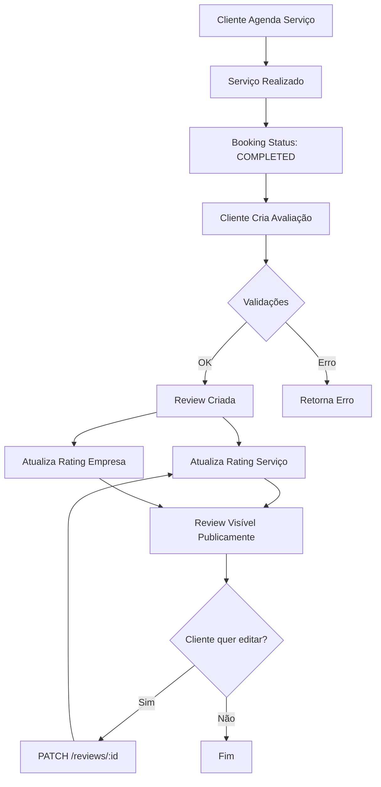

# ⭐ Reviews API Documentation

API completa para sistema de avaliações de serviços e empresas.

## Base URL
```
http://localhost:4000/api/reviews
```

## Autenticação
Rotas protegidas requerem token JWT no header:
```
Authorization: Bearer {token}
```

---

## 📋 Índice

1. [Criar Avaliação](#1-criar-avaliação)
2. [Listar Avaliações](#2-listar-avaliações)
3. [Buscar Avaliação por ID](#3-buscar-avaliação-por-id)
4. [Atualizar Avaliação](#4-atualizar-avaliação)
5. [Remover Avaliação](#5-remover-avaliação)
6. [Estatísticas de Serviço](#6-estatísticas-de-serviço)
7. [Estatísticas de Empresa](#7-estatísticas-de-empresa)

---

## 1. Criar Avaliação

Cria uma avaliação para um agendamento concluído.

**Endpoint:** `POST /api/reviews`

**Acesso:** Privado (Cliente que realizou o agendamento)

### Request Body
```json
{
  "bookingId": "550e8400-e29b-41d4-a716-446655440000",
  "rating": 5,
  "comment": "Excelente serviço! Profissionais muito atenciosos e ambiente agradável. Recomendo!"
}
```

### Campos Obrigatórios
- `bookingId` (string, UUID) - ID do agendamento
- `rating` (number, 1-5) - Nota de avaliação

### Campos Opcionais
- `comment` (string, 10-1000 caracteres) - Comentário da avaliação

### Response (201 Created)
```json
{
  "success": true,
  "data": {
    "id": "review-uuid",
    "bookingId": "550e8400-e29b-41d4-a716-446655440000",
    "userId": "user-uuid",
    "userName": "João Silva",
    "serviceId": "service-uuid",
    "serviceName": "Corte de Cabelo",
    "companyId": "company-uuid",
    "companyName": "Studio Hair & Beauty",
    "rating": 5,
    "comment": "Excelente serviço! Profissionais muito atenciosos e ambiente agradável. Recomendo!",
    "createdAt": "2026-01-18T16:00:00.000Z",
    "updatedAt": "2026-01-18T16:00:00.000Z"
  }
}
```

### Regras de Negócio
- Agendamento deve estar COMPLETED (concluído)
- Usuário deve ser o dono do agendamento
- Cada agendamento pode ter apenas uma avaliação
- Rating do serviço e empresa são atualizados automaticamente

### Erros Possíveis
- `400` - Agendamento não concluído ou já avaliado
- `401` - Não autenticado
- `403` - Sem permissão para avaliar este agendamento
- `404` - Agendamento não encontrado

---

## 2. Listar Avaliações

Lista avaliações com filtros avançados.

**Endpoint:** `GET /api/reviews`

**Acesso:** Público

### Query Parameters
```
?serviceId=service-uuid
&companyId=company-uuid
&userId=user-uuid
&minRating=4
&sortBy=rating
&order=desc
&page=1
&limit=20
```

### Filtros Disponíveis
- `serviceId` (UUID) - Filtrar por serviço
- `companyId` (UUID) - Filtrar por empresa
- `userId` (UUID) - Filtrar por usuário (autor)
- `minRating` (1-5) - Rating mínimo
- `sortBy` (rating | createdAt) - Ordenar por
- `order` (asc | desc) - Ordem
- `page` (number, default: 1)
- `limit` (number, 1-100, default: 20)

### Response (200 OK)
```json
{
  "success": true,
  "data": {
    "reviews": [
      {
        "id": "review-uuid",
        "bookingId": "booking-uuid",
        "userId": "user-uuid",
        "userName": "João Silva",
        "serviceId": "service-uuid",
        "serviceName": "Corte de Cabelo",
        "companyId": "company-uuid",
        "companyName": "Studio Hair & Beauty",
        "rating": 5,
        "comment": "Excelente serviço!",
        "createdAt": "2026-01-18T16:00:00.000Z",
        "updatedAt": "2026-01-18T16:00:00.000Z"
      }
    ],
    "pagination": {
      "total": 45,
      "page": 1,
      "limit": 20,
      "totalPages": 3,
      "hasNext": true,
      "hasPrev": false
    }
  }
}
```

### Exemplos de Uso

**Avaliações de um serviço específico:**
```
GET /api/reviews?serviceId=550e8400-e29b-41d4-a716-446655440000
```

**Avaliações 5 estrelas de uma empresa:**
```
GET /api/reviews?companyId=company-uuid&minRating=5
```

**Últimas avaliações (mais recentes primeiro):**
```
GET /api/reviews?sortBy=createdAt&order=desc
```

**Avaliações de um usuário:**
```
GET /api/reviews?userId=user-uuid
```

---

## 3. Buscar Avaliação por ID

Busca detalhes de uma avaliação específica.

**Endpoint:** `GET /api/reviews/:id`

**Acesso:** Público

### Response (200 OK)
```json
{
  "success": true,
  "data": {
    "id": "review-uuid",
    "bookingId": "booking-uuid",
    "userId": "user-uuid",
    "userName": "João Silva",
    "serviceId": "service-uuid",
    "serviceName": "Corte de Cabelo",
    "companyId": "company-uuid",
    "companyName": "Studio Hair & Beauty",
    "rating": 5,
    "comment": "Excelente serviço!",
    "createdAt": "2026-01-18T16:00:00.000Z",
    "updatedAt": "2026-01-18T16:00:00.000Z"
  }
}
```

### Erros Possíveis
- `400` - UUID inválido
- `404` - Avaliação não encontrada

---

## 4. Atualizar Avaliação

Atualiza rating e/ou comentário de uma avaliação.

**Endpoint:** `PATCH /api/reviews/:id`

**Acesso:** Privado (Autor da avaliação)

### Request Body
```json
{
  "rating": 4,
  "comment": "Serviço bom, mas poderia melhorar no atendimento."
}
```

### Campos Opcionais
Todos os campos são opcionais (pode atualizar apenas um):
- `rating` (number, 1-5)
- `comment` (string, 10-1000 caracteres)

### Response (200 OK)
```json
{
  "success": true,
  "data": {
    "id": "review-uuid",
    "rating": 4,
    "comment": "Serviço bom, mas poderia melhorar no atendimento.",
    "updatedAt": "2026-01-18T17:00:00.000Z"
  }
}
```

### Regras de Negócio
- Apenas o autor pode atualizar sua avaliação
- Se o rating mudar, ratings de serviço e empresa são recalculados
- Pelo menos um campo deve ser fornecido

### Erros Possíveis
- `400` - Dados inválidos ou nenhum campo fornecido
- `401` - Não autenticado
- `403` - Sem permissão para editar esta avaliação
- `404` - Avaliação não encontrada

---

## 5. Remover Avaliação

Remove uma avaliação.

**Endpoint:** `DELETE /api/reviews/:id`

**Acesso:** Privado (Autor da avaliação)

### Response (200 OK)
```json
{
  "success": true,
  "message": "Avaliação removida com sucesso"
}
```

### Regras de Negócio
- Apenas o autor pode deletar sua avaliação
- Ratings de serviço e empresa são recalculados automaticamente
- Agendamento pode receber nova avaliação após deleção

### Erros Possíveis
- `401` - Não autenticado
- `403` - Sem permissão para deletar esta avaliação
- `404` - Avaliação não encontrada

---

## 6. Estatísticas de Serviço

Busca estatísticas de avaliações de um serviço.

**Endpoint:** `GET /api/reviews/service/:serviceId/stats`

**Acesso:** Público

### Response (200 OK)
```json
{
  "success": true,
  "data": {
    "averageRating": 4.6,
    "totalReviews": 127,
    "ratingDistribution": {
      "1": 2,
      "2": 5,
      "3": 15,
      "4": 38,
      "5": 67
    }
  }
}
```

### Campos do Response
- `averageRating` (number) - Média de rating (0.00 - 5.00)
- `totalReviews` (number) - Total de avaliações
- `ratingDistribution` (object) - Distribuição de notas

### Exemplo de Uso
Esta rota é útil para:
- Exibir rating médio na página do serviço
- Mostrar gráfico de distribuição de notas
- Calcular percentual de satisfação

### Erros Possíveis
- `400` - UUID inválido
- `404` - Serviço não encontrado

---

## 7. Estatísticas de Empresa

Busca estatísticas agregadas de todas as avaliações de uma empresa.

**Endpoint:** `GET /api/reviews/company/:companyId/stats`

**Acesso:** Público

### Response (200 OK)
```json
{
  "success": true,
  "data": {
    "averageRating": 4.8,
    "totalReviews": 456,
    "ratingDistribution": {
      "1": 3,
      "2": 8,
      "3": 25,
      "4": 120,
      "5": 300
    }
  }
}
```

### Regras de Negócio
- Agrega avaliações de todos os serviços da empresa
- Útil para dashboard da empresa
- Atualizado em tempo real

### Erros Possíveis
- `400` - UUID inválido
- `404` - Empresa não encontrada

---

## 🔐 Níveis de Acesso

| Endpoint | Público | Cliente | Empresa | Admin |
|----------|---------|---------|---------|-------|
| POST /reviews | ❌ | ✅ (próprios) | ❌ | ❌ |
| GET /reviews | ✅ | ✅ | ✅ | ✅ |
| GET /reviews/:id | ✅ | ✅ | ✅ | ✅ |
| PATCH /reviews/:id | ❌ | ✅ (própria) | ❌ | ❌ |
| DELETE /reviews/:id | ❌ | ✅ (própria) | ❌ | ✅ |
| GET /service/:id/stats | ✅ | ✅ | ✅ | ✅ |
| GET /company/:id/stats | ✅ | ✅ | ✅ | ✅ |

---

## 🚨 Códigos de Erro

### 400 Bad Request
```json
{
  "success": false,
  "message": "Dados inválidos",
  "errors": [
    {
      "field": "rating",
      "message": "Rating deve estar entre 1 e 5"
    }
  ]
}
```

**Causas comuns:**
- Rating fora do intervalo 1-5
- Comentário muito curto (< 10 caracteres)
- UUID inválido
- Agendamento não concluído
- Agendamento já avaliado

### 401 Unauthorized
```json
{
  "success": false,
  "message": "Token inválido ou expirado"
}
```

### 403 Forbidden
```json
{
  "success": false,
  "message": "Você não tem permissão para avaliar este agendamento"
}
```

**Causas:**
- Tentando avaliar agendamento de outro usuário
- Tentando editar/deletar avaliação de outro usuário

### 404 Not Found
```json
{
  "success": false,
  "message": "Avaliação não encontrada"
}
```

---

## 📝 Regras de Negócio

### Criação de Avaliação
1. **Agendamento Concluído**: Só pode avaliar agendamentos com status COMPLETED
2. **Uma Avaliação por Agendamento**: Cada booking pode ter apenas uma review
3. **Proprietário**: Só pode avaliar seus próprios agendamentos
4. **Atualização Automática**: Rating de serviço e empresa são recalculados

### Rating System
- **Escala**: 1 a 5 estrelas
- **Cálculo**: Média aritmética de todas as avaliações
- **Precisão**: 2 casas decimais (ex: 4.67)
- **Atualização**: Imediata após criar/atualizar/deletar review

### Comentários
- **Opcional**: Não é obrigatório deixar comentário
- **Mínimo**: 10 caracteres
- **Máximo**: 1000 caracteres
- **Editável**: Pode ser atualizado pelo autor

### Permissões
- **Criar**: Qualquer cliente autenticado (próprio booking)
- **Editar**: Apenas autor da review
- **Deletar**: Autor ou administrador
- **Visualizar**: Público (todas as reviews)

---

## 💡 Exemplos de Uso

### Cenário 1: Cliente Avaliando Serviço

```javascript
// 1. Cliente conclui agendamento
// 2. Sistema marca booking como COMPLETED
// 3. Cliente acessa tela de avaliação

POST /api/reviews
Authorization: Bearer {client_token}

{
  "bookingId": "booking-uuid",
  "rating": 5,
  "comment": "Adorei o resultado! Voltarei com certeza."
}

// 4. Sistema atualiza rating do serviço e empresa
// 5. Review aparece no perfil do serviço
```

### Cenário 2: Página de Serviço

```javascript
// 1. Buscar estatísticas do serviço
GET /api/reviews/service/{service-id}/stats

// Resposta:
{
  "averageRating": 4.8,
  "totalReviews": 234,
  "ratingDistribution": { ... }
}

// 2. Listar últimas avaliações
GET /api/reviews?serviceId={service-id}&sortBy=createdAt&order=desc&limit=5

// 3. Exibir na página:
// ⭐⭐⭐⭐⭐ 4.8 (234 avaliações)
// + Lista das 5 mais recentes
```

### Cenário 3: Dashboard da Empresa

```javascript
// Buscar estatísticas gerais
GET /api/reviews/company/{company-id}/stats

// Resposta mostra desempenho geral:
{
  "averageRating": 4.6,
  "totalReviews": 1234,
  "ratingDistribution": {
    "5": 800,  // 65% - Excelente!
    "4": 300,  // 24%
    "3": 100,  // 8%
    "2": 20,   // 2%
    "1": 14    // 1%
  }
}
```

### Cenário 4: Filtros Avançados

```javascript
// Reviews 5 estrelas com comentário de São Paulo
GET /api/reviews?companyId={id}&minRating=5&page=1&limit=10

// Reviews de um cliente específico
GET /api/reviews?userId={user-id}

// Top reviews (melhor avaliadas primeiro)
GET /api/reviews?sortBy=rating&order=desc
```

---

## 🔄 Fluxo Completo



---

## 📊 Cálculo de Rating

### Algoritmo
```javascript
// Exemplo de cálculo
reviews = [5, 5, 4, 5, 3, 4, 5]

soma = 5 + 5 + 4 + 5 + 3 + 4 + 5 = 31
total = 7
média = 31 / 7 = 4.43

// Arredondado para 2 casas decimais
rating = 4.43 ⭐
```

### Distribuição
```
5 ⭐: 4 reviews (57%)  ████████████████████
4 ⭐: 2 reviews (29%)  ██████████
3 ⭐: 1 review  (14%)  █████
2 ⭐: 0 reviews (0%)   
1 ⭐: 0 reviews (0%)   
```

---

## 🎯 Melhores Práticas

### Para Clientes
1. Aguarde a conclusão do serviço
2. Seja honesto e construtivo
3. Detalhe sua experiência no comentário
4. Use a escala corretamente:
   - ⭐ Péssimo
   - ⭐⭐ Ruim
   - ⭐⭐⭐ Regular
   - ⭐⭐⭐⭐ Bom
   - ⭐⭐⭐⭐⭐ Excelente

### Para Empresas
1. Monitore suas avaliações regularmente
2. Responda feedbacks (futuro: reply system)
3. Use estatísticas para melhorar serviços
4. Incentive clientes satisfeitos a avaliar

### Para Desenvolvedores
1. Cache estatísticas para performance
2. Indexe campos de busca frequente
3. Implemente paginação em queries
4. Valide permissões cuidadosamente

---

**Última atualização:** 18/01/2026
